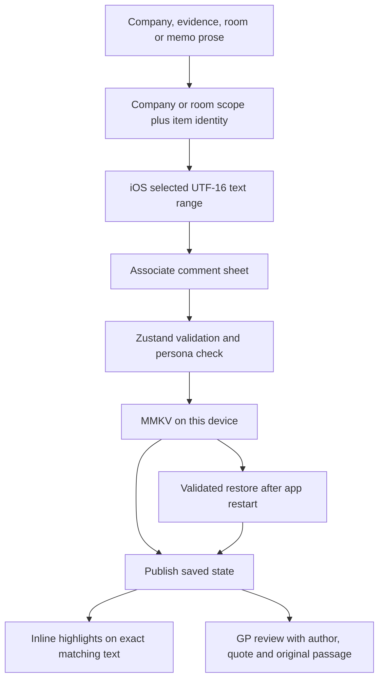

# Local diligence annotations

```mermaid
graph TD
  A[Company, evidence, room or memo prose] --> B[Company or room scope plus item identity]
  B --> C[iOS selected UTF-16 text range]
  C --> D[Associate comment sheet]
  D --> E[Zustand validation and persona check]
  E --> F[MMKV on this device]
  F --> G[Publish saved state]
  G --> H[Inline highlights on exact matching text]
  G --> I[GP review with author, quote and original passage]
  F --> J[Validated restore after app restart]
  J --> G
```

Saving a note has no API edge. Existing research/steering API traffic is independent of this local overlay. A changed source does not inherit an old highlight.
